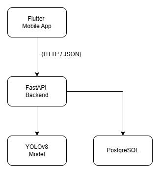
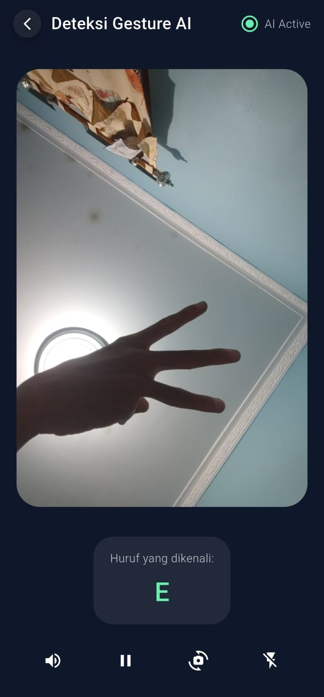
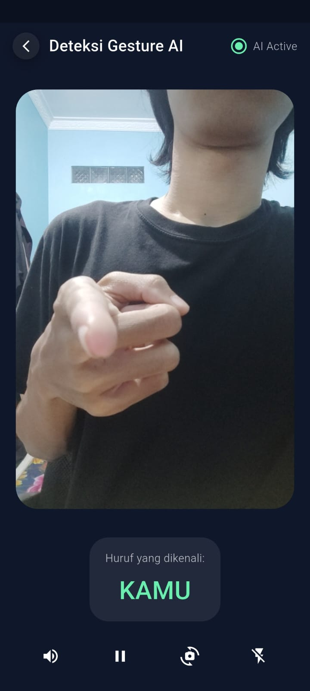
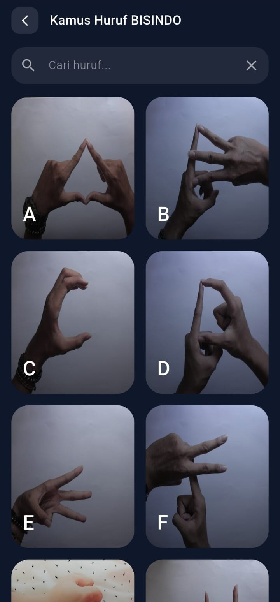
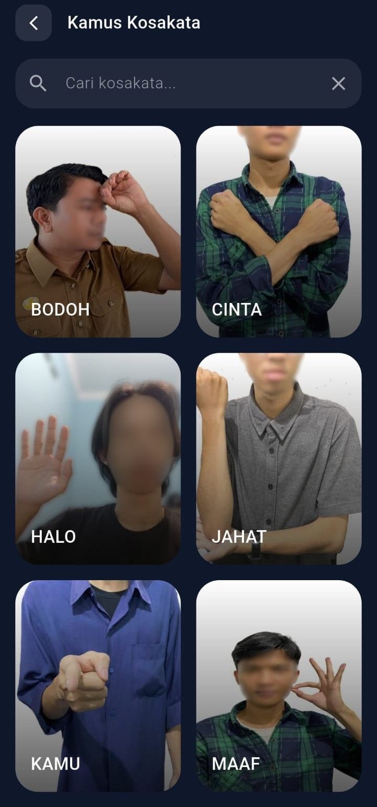
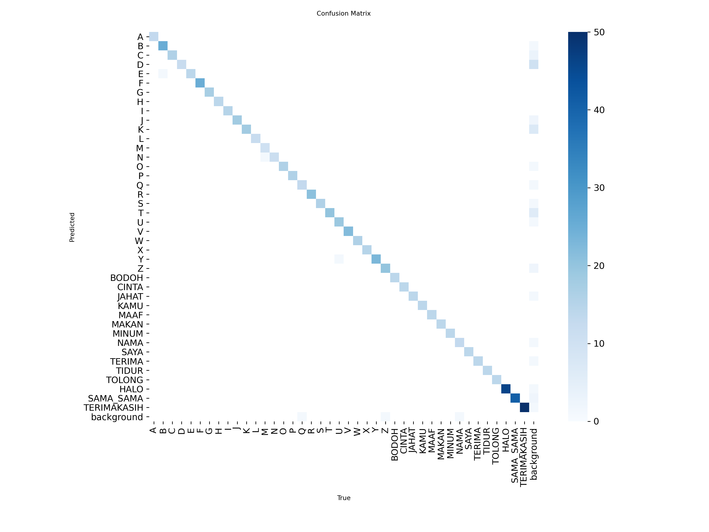
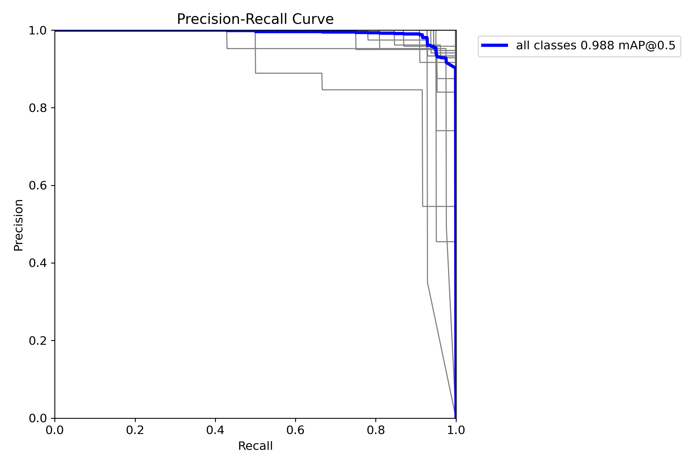
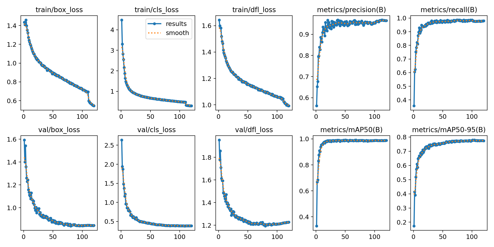

# Indonesian Sign Language Detection

An Indonesian Sign Language (BISINDO) recognition system based on YOLOv8, developed as a final year capstone project. This system enables users to detect BISINDO alphabet signs and vocabulary in real-time through a Flutter mobile application connected to a FastAPI backend and a YOLOv8 object detection model.

---

## Features

- **Real-time Sign Detection:** Supports 26 alphabet classes and 15 vocabulary classes in BISINDO.
- **Cross-Platform Mobile App:** Built with Flutter.
- **Robust REST API:** Powered by FastAPI for fast, asynchronous request handling and inference routing.
- **Relational Database Integration:** Uses PostgreSQL to store and manage dictionary data.
- **In-App Dictionary:** Features reference lists for both BISINDO alphabet signs and vocabulary words.

---

## System Architecture



---

## Application Screenshots

### Splash Screen


### Home Screen


### Detection Feature



### Alphabet Dictionary


### Vocabulary Dictionary


---

## Dataset Information

| Description           | Total     |
|-----------------------|-----------|
| Alphabet Classes      | 26        |
| Vocabulary Classes    | 15        |
| **Total Classes**     | **41**    |
| **Total Images**      | **7,586** |

---

## Model Evaluation

Model trained using YOLOv8 on a BISINDO dataset consisting of 41 classes and 7,586 images.

| Metric    | Value  |
|-----------|--------|
| mAP50     | 0.988  |
| mAP50-95  | 0.779  |
| Precision | 0.953  |
| Recall    | 0.984  |

---

### Confusion Matrix



### Precision-Recall Curve



### Training Results



---

## Technology Stack

### Frontend
- Flutter
- Dart

### Backend
- FastAPI
- SQLAlchemy

### AI Model
- YOLOv8

### Database
- PostgreSQL

### Other Libraries
- OpenCV
- NumPy

---

## Project Structure

```text
indonesian-sign-language-detection/
│
├── backend/
│   ├── app/
│   ├── otak_ai/
│   └── requirements.txt
│
├── frontend/
│   ├── lib/
│   ├── assets/
│   └── pubspec.yaml
│
├── database/
│   └── db_kamus.sql
│
├── docs/
│   └── screenshots/
│
└── README.md
```

---

### Prerequisites (Prasyarat)

- Python 3.10+
- Flutter 3.x
- PostgreSQL 15+

---

## Installation

### Clone Repository

```bash
git clone https://github.com/augustsev/indonesian-sign-language-detection.git
cd indonesian-sign-language-detection
```

---

### Backend Setup

```bash
cd backend

pip install -r requirements.txt

uvicorn app.main:app --reload
```

Backend will run at:

```text
http://localhost:8000
```

---

### Database Setup

Create PostgreSQL database and import:

```text
database/db_kamus.sql
```

Configure database connection using:

```text
backend/.env
```

Example:

```env
DB_USER=postgres
DB_PASSWORD=your_password
DB_HOST=localhost
DB_PORT=5432
DB_NAME=data_kamus_bisindo
```

---

### Frontend Setup

```bash
cd frontend

flutter pub get

flutter run
```

---

## Model Files

The trained YOLOv8 model is located in:

```text
backend/otak_ai/yolov8-update-kosakata3/weights/
```

Available formats:

```text
best.pt
best.onnx
```

---

## Documentation

This repository contains:

- Flutter mobile application
- FastAPI backend service
- YOLOv8 trained model
- PostgreSQL database schema
- System documentation and screenshots

---

## Author

**Agus Purwanto**

Information Technology
Universitas Teknologi Yogyakarta
Yogyakarta, Indonesia

GitHub:
https://github.com/augustsev